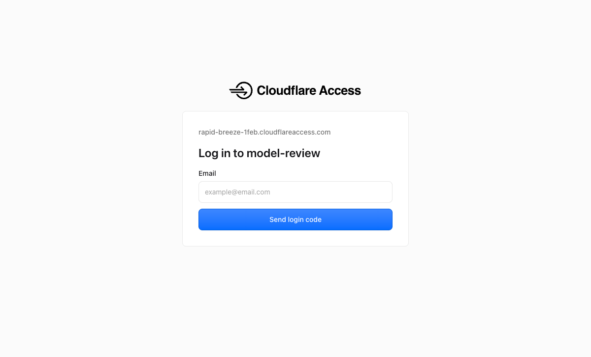
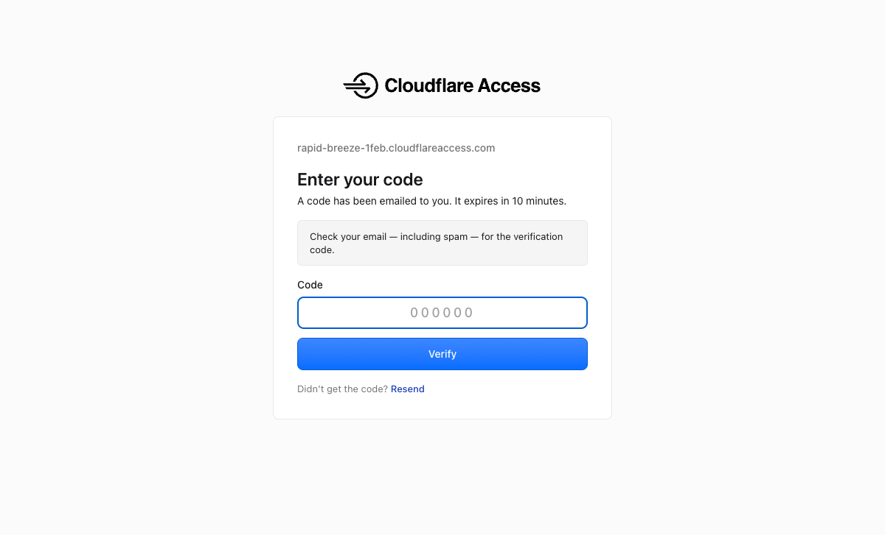
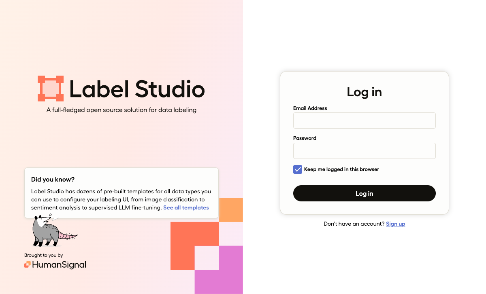
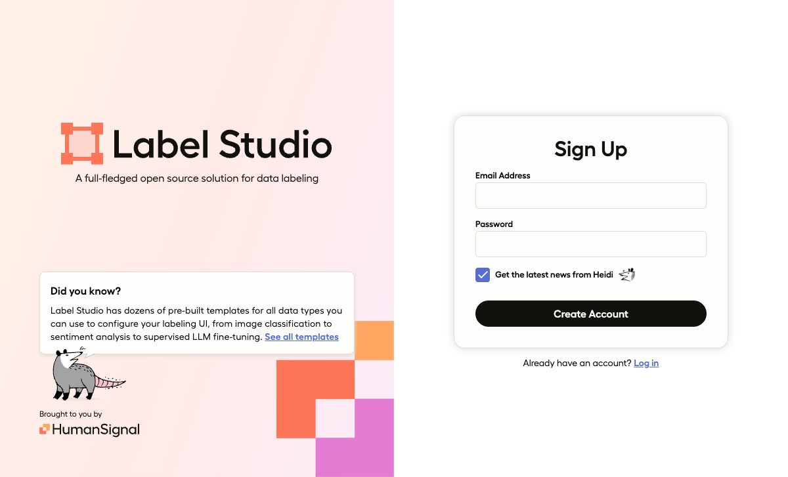
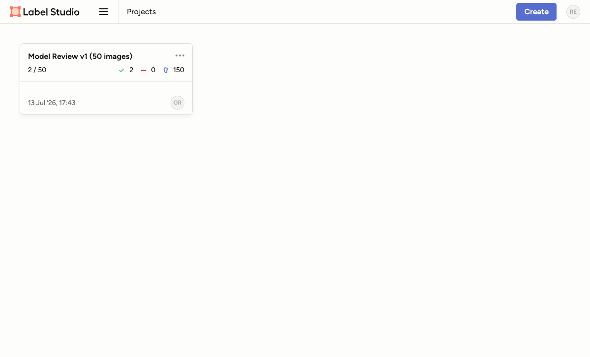
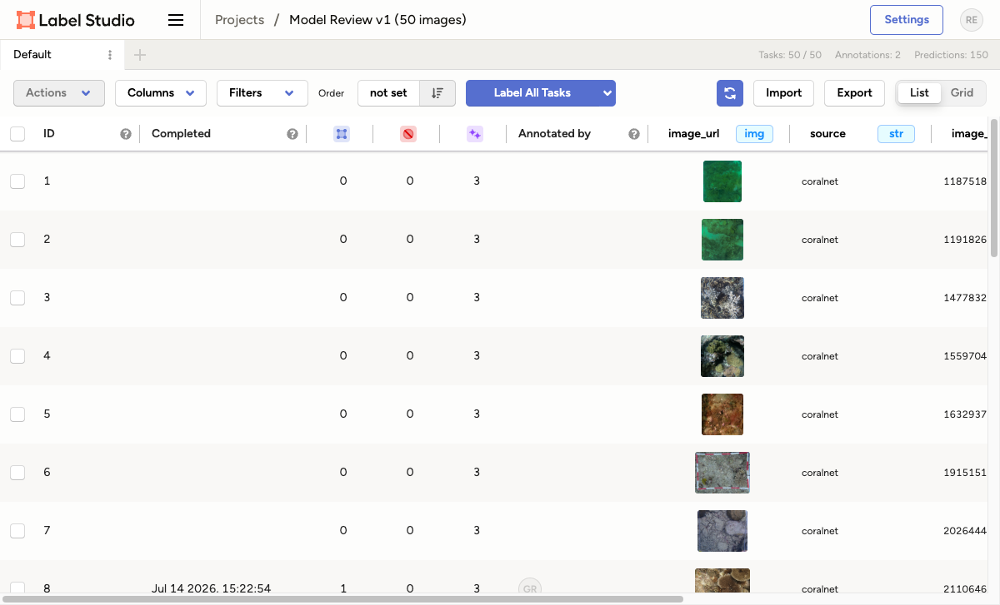
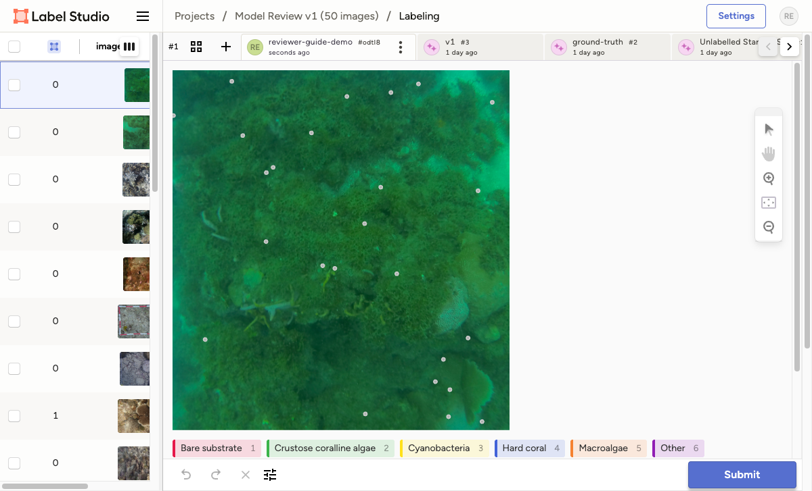
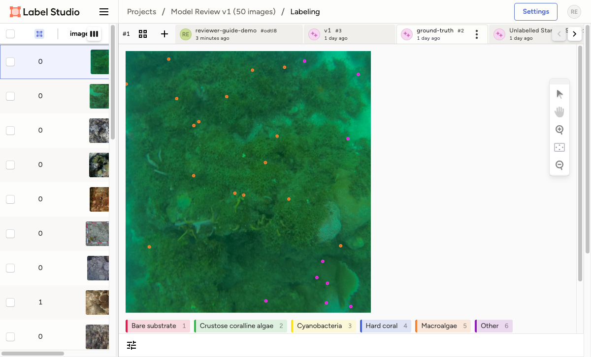
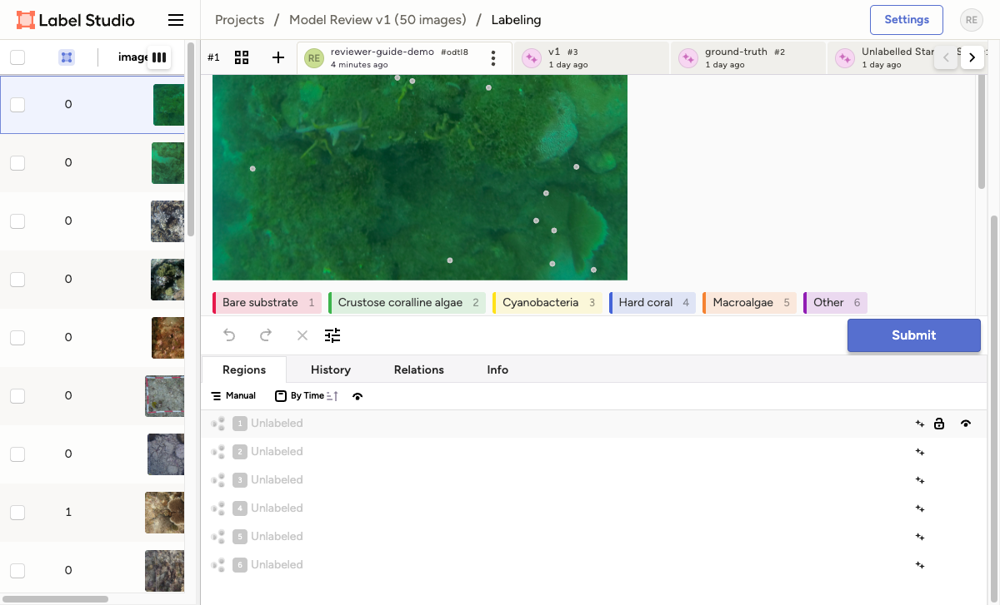
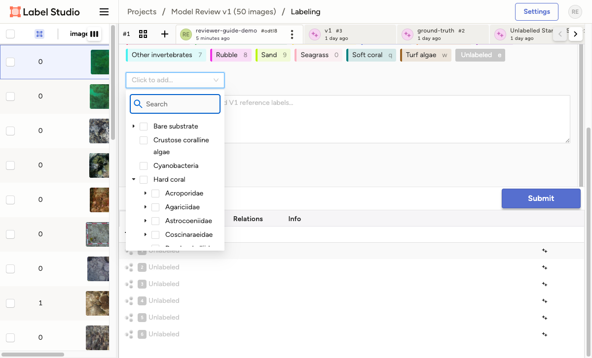

# Reviewer guide — MERMAID model-review annotation

Thank you for helping review the classifier! Your job is to look at a set of coral-reef
images, and for each pre-placed point on an image, choose the benthic attribute you see at
that point. Your labels are compared against the model and the ground truth.

The app is at **https://model-review.datamermaid.org/**. This guide walks through logging
in, then how to label.

- [Part 1 — Log in](#part-1--log-in)
- [Part 2 — Open your project](#part-2--open-your-project)
- [Part 3 — Label an image](#part-3--label-an-image)
- [Part 4 — Tips & FAQ](#part-4--tips--faq)

---

## Part 1 — Log in

Logging in has **two layers**: first Cloudflare (which checks your email is allowed), then
Label Studio (the labeling app itself).

### Step 1 — Cloudflare: request a login code

Open **https://model-review.datamermaid.org/**. You'll land on a **Cloudflare Access** page.
Type your email address and click **Send login code**.

> Use the email address you were invited with — other addresses are rejected.

### Step 2 — Cloudflare: enter the emailed code

Cloudflare emails you a **6-digit code** (check spam if you don't see it). Enter it and click
**Verify**. The code **expires in 10 minutes** — if it does, click *Resend*.

### Step 3 — Label Studio: create your account (first time only)

After Cloudflare, you reach the **Label Studio** login page.

**The first time**, you need a Label Studio account. Click **Sign up**, enter an email and a
password, and click **Create Account**.

> **Use your own account.** Every label you make is stamped with your account, which is how
> your review is credited and compared. Don't share a login. After the first time, just
> **Log in** with the same email and password.

---

## Part 2 — Open your project

After logging in you'll see the **Projects** list. Click the review project (e.g.
*"Model Review v1"*) to open it. Your account name is shown top-right.

You'll see the list of images in the project. Click any image row to open it for labeling
(or use **Label All Tasks** to go through them in order).

---

## Part 3 — Label an image

This is the main screen. Here's what everything is:

### ⚠️ First: make sure you're on YOUR tab

Across the top are several tabs. **Only the tab with _your_ name is yours to edit** — it's
selected by default when you open an image. The others are **read-only references**:

| Tab | What it is |
| --- | --- |
| **your-name** (e.g. `reviewer-guide-demo`) | **Your annotation — this is the one you fill in.** |
| `v1` | The new model's predictions (reference only). |
| `ground-truth` | The known correct labels (reference only). |
| `Beta` | What the model currently running in MERMAID predicts (reference only). |
| `Unlabelled Starting Set` | The blank starting points (reference only). |

Do your labeling on **your** tab. You can peek at the reference tabs *after* your pass to
compare — but don't edit them.

### The points

Each image has a fixed set of points. On your tab they start **grey / unlabelled**. Your task
is to give **each** point a label. There are **two things** you set per point, and it's
important to understand the difference:

#### 1. Point color = the broad, top-level category

The colored buttons along the bottom are the **top-level categories** (Hard coral, Macroalgae,
Sand, …), each with a number/letter shortcut key. The label you pick here sets the **color of
the dot**. This is the coarse grouping. On a reference tab you can see the dots colored this
way:

#### 2. Drop-down = the fine-grained label

The broad category is not enough — you also choose the **precise** benthic attribute from a
**searchable drop-down**. Click a point to select it (or click its row in the **Regions**
panel), and a **"Click to add…"** drop-down appears:

Open that drop-down to get the full taxonomy tree. You can **type to search**, or expand a
category with the ► arrow:

Expanding a category reveals the fine-grained options beneath it (families → genera →
growth forms):

> **In short:** the **color** is the broad group (a quick visual); the **drop-down** is the
> exact label. Set both for every point — pick the top-level color, then the precise label
> from the drop-down.

### Labeling a point, step by step

1. Click a point on the image (or its row in the **Regions** panel on the right).
2. Click its **top-level category** button at the bottom (or press its shortcut key) — the dot
   takes that category's color.
3. Open the **"Click to add…"** drop-down and pick the **precise** label (search or expand).
4. Repeat for every point on the image.

Use the **notes box** under the image for anything worth flagging about an image.

### Submit

When every point on the image has a label, click **Submit** (bottom-right). Label Studio saves
your work and moves you to the next image.

---

## Part 4 — Tips & FAQ

- **Do every point.** Each image is only "done" when all its points are labelled and you've
  hit **Submit**.
- **Label blind first.** Start from the grey points on your own tab. Only look at the
  `v1` / `ground-truth` / `Beta` reference tabs *after* you've made your own call.
- **A few labels in the tree only `Beta` uses.** The tree covers every label any reference
  tab can show, so it includes some coarse options (`Hard coral > Massive`, `Hard coral >
  Encrusting`, plain `Other invertebrates`) that only `Beta` predicts. Pick the most specific
  label you're confident in — don't use the coarse ones to avoid committing to a genus.
- **Your progress is saved on Submit.** You can log out and come back; finished images stay
  finished.
- **Cloudflare code expired?** Just request a new one — it's only the outer gate; it doesn't
  affect your Label Studio account or saved work.
- **Logging out / switching account:** use the avatar menu at the top-right.
- **Can't see the images (blank grey squares)?** Tell the project admin — it's usually a
  one-time server-side setting, not something you can fix from your side.
